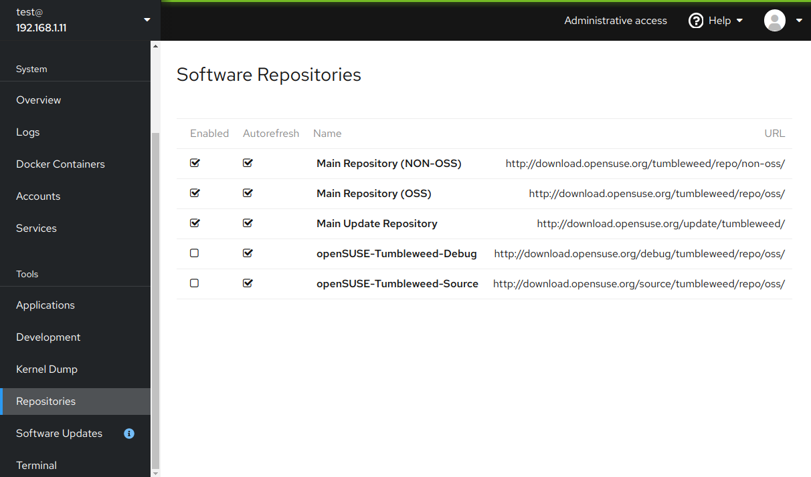

# cockpit-plugins

Experimental plugins for [Cockpit](https://cockpit-project.org/),
just as a proof of concept, not for production use...

## Repository Manager

A simple repository manager



Note: Uses `zypper` command as a backend, that mean it will only work in
the (open)SUSE distributions!

## TODO

- [ ] Add an alternative implementation using the [PackageKit](
  https://www.freedesktop.org/software/PackageKit/gtk-doc/index.html)
  [DBus API](https://www.freedesktop.org/software/PackageKit/gtk-doc/api-reference.html) (that will also work on another distributions...)

## Testing

```shell
git clone https://github.com/lslezak/cockpit-plugins.git
mkdir -p ~/.local/share/cockpit
ln -s ~/cockpit-plugins/* ~/.local/share/cockpit
```
