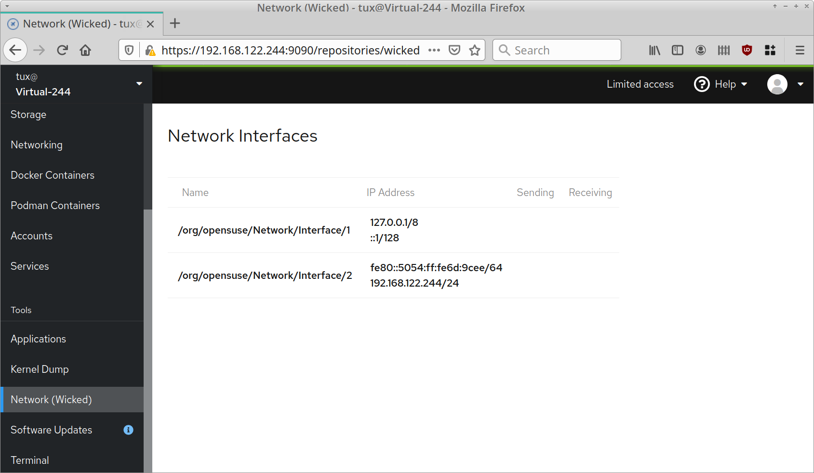

# cockpit-plugins

Experimental plugins for [Cockpit](https://cockpit-project.org/),
just as a proof of concept, not for production use...

## Networking with Wicked



Note: Uses `wicked show-xml` command as a backend, no DBus yet.

## Testing

```shell
git clone https://github.com/mvidner/cockpit-wicked-plugin
cd cockpit-wicked-plugin
mkdir -p ~/.local/share/cockpit
ln -s `pwd`/*/ ~/.local/share/cockpit
```
